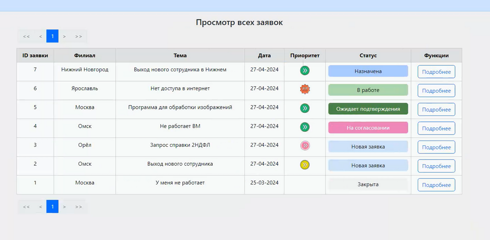

# OpenHelpDesk для учёта заявок

## Description

Проект OpenHelpDesk представляет из себя систему по обработке и учёту заявок на обслуживание как в ИТ отделе, так и в других отделах компании.
Поступление и работа с заявками производится через WEB, таким образом обеспечивается простота работы как пользователей, создающих заявки, так и операторов, работающих с системой. 

## Capability

- Полноценная работа с заявками на обслуживание;
- Удобная и простая форма для создания заявок через WEB;
- 10 различных статусов в заявках;
- Возможность оставлять комментарий, изображения, файлы;
- Создание локальных пользователей;
- Возможность интеграции пользователей с корпоративным доменом через LDAP с проверкой группы доступа;
- Автоматическая выгрузка атрибутов о пользователе из LDAP таких как телефон, e-mail, подразделение и отдел.
- Уведомления через e-mail;

## Requirements:

- Web сервер
- MySQL
- PHP >= 8.2.4
- LDAP модуль в PHP
- GD  модуль в PHP
- Python >= 3.10

## Setting:
1. Создать базу данных MySQL «ithelp». Dump базы данных находится в файле «dump-ithelp.sql»;
2. Прописать доступ для PHP до БД «ithelp» в файле «http/data/db.php»;
3. Включить расширения LDAP и GD в «php.ini»;
6. Прописать доступ для Python скрипта до БД «ithelp» в файле «python/services.py.py»;
7. Создать автозапуск скрипта "python/services.py.py".
8. Проверить время и часовой пояс на сервере www.

